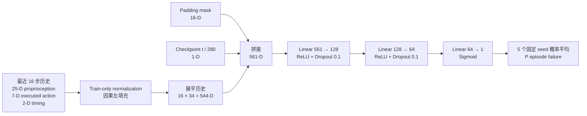
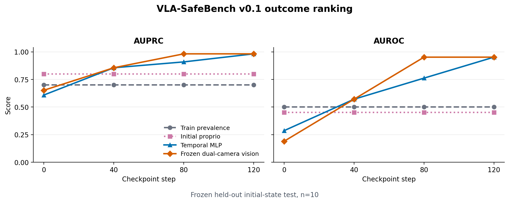

# VLA-SafeBench

VLA-SafeBench 是一个基于 SmolVLA 和 LIBERO 的闭环评测项目，用来研究机器人策略失败时，系统能够观察到什么、预测什么，以及哪些结论不能从现有数据推出。

当前核心发现是：冻结视觉与状态/动作模型都能稳定预测 task 4 的最终 outcome，但这种能力主要来自**任务执行进度**。在预先冻结的 100 条 v0.3 轨迹上，vision-step80 的原始 AUPRC/AUROC 为 `0.926/0.863`；只使用黑碗、抽屉、盘子和夹爪的真实任务阶段即可达到 `0.947/0.908`。按 initial state 做 leave-one-group-out 阶段控制后，vision 与 temporal 的残差 AUROC 分别降至 `0.426` 和 `0.514`，置信区间均包含随机水平。因此 Phase 1 证明了 outcome association 的可重复性，也确认它不能解释为独立失效前兆。风险分数只用于 Outcome Prediction 和离线效率分析，不能作为即将发生危险或安全停止的依据。

Phase 2 重新定义了带明确事件时刻的 pickup-stall pilot：在首次接近对齐并控制 checkpoint 当前物体位移后，16步 temporal MLP 相对 privileged stage baseline 的 test AUROC 增量为 `+0.321 [0.042, 0.750]`，显示初步的未来20步 stall-confirmation 排序信号。该结果只有4个 test initial-state clusters、27个 event-positive episodes，属于 pilot，不支持通用失效检测或 safe-stop 主张。

## 四周执行状态

| 阶段 | 状态 | 已完成 | 尚未完成 |
| --- | --- | --- | --- |
| **Day 0–3 / Week 1** | **完成** | SmolVLA + LIBERO 闭环；从首步启用同步日志和双相机视频；20-episode 性能/成本验收；50 条 task-4 自然 rollout；事件覆盖统计；冻结 30/10/10 group-disjoint split；确定 Outcome 主线 | 无 Week-1 阻塞项 |
| **Week 2** | **完成** | Initial-proprio difficulty baseline；16-step state/action temporal MLP；冻结 ResNet-50 双相机 predictor；paired episode bootstrap；输入泄漏测试；RGB/error、LOEO 和关键 false-negative 审计；形成 execution-progress 假设 | 不再增加 Transformer 或继续调参 |
| **Week 3** | **完成** | 主/腕/双相机消融；offline utility；risk 曲线与视频；定量进度控制实验 | 无 Week-3 阻塞项 |
| **Week 4** | **完成** | 完成度和 claim audit；A1 case table；60 条 A2 配对 rollout；command-effect evaluation；21-file release checksum | 无 Week-4 阻塞项 |
| **v0.2 post-release audit** | **完成** | Initial-state identity audit；temporal checkpoint-feature ablation；20 条冻结模型独立确认集 | 不改写 v0.1 test 或选模结果 |
| **v0.3 stage-control audit** | **完成** | 100 条预声明轨迹；真实物体阶段记录；initial-state cluster bootstrap；同状态阶段匹配 | Phase 1 机制结论已冻结 |
| **v0.4 pickup-stall pilot** | **Pilot 完成** | 首次接近对齐；明确 `t_event`；gray zone；strict stage constraint；同状态对照；cluster bootstrap | 仅 temporal 通过 pilot 增量门槛；正式样本量尚未达到 |

四周主计划已在 v0.1 收口。v0.2 验证原 split 和模型信号的可重复性；v0.3 针对“模型是否只读进度”预先冻结采样与分析协议，并给出 Phase 1 的最终机制结论。后续审计不倒写为原四周计划内的预注册实验，也不修改 v0.1 test 或选模结果。

## 1. 研究问题

| Regime | 含义 | 示例 | 合适的处理方式 |
| --- | --- | --- | --- |
| **A1：语法/协议故障** | 数据格式或明确约束被破坏 | shape、dtype、NaN/Inf、时间戳倒退、显式越界 | 确定性规则监控器 |
| **A2：语义配置故障** | 数值合法，但部署含义错误 | 动作维度置换、符号/单位错误、相机映射错位、chunk 语义错误 | command-effect consistency 与专门训练的故障检测器 |
| **B：自然/涌现失败** | 配置正常，策略仍未完成任务 | 偏移、停滞、误差累积、遮挡或场景歧义 | 学习式 Outcome 或 Impending predictor |

三类问题必须分开报告。容易检测的 A1 不能与困难的 A2/B 合并成一个总准确率。

项目研究四个问题：

1. **RQ1（A1/A2）：** 规则监控器能拦截多少协议错误？面对数值合法的语义配置错误，command-effect consistency 和学习监控分别能覆盖多少？
2. **RQ2a（Outcome Prediction）：** 根据当前历史，能否预测 episode 最终成功或失败？
3. **RQ2b（Impending Failure Detection）：** 对具有明确事件时刻的危险事件，能否预测未来 `K` 步内是否发生？
4. **RQ3（Utility / Control）：** 预测结果能否节省无效 rollout 计算，或在有可靠 Impending 标签时支持安全干预？

当前完成的是 **RQ2a 的单任务阶段结果和离线 efficiency 分析，以及 RQ1 的有界 supporting study**。RQ1 尚未包含 learned A2 monitor；RQ2b 和真实闭环干预尚未完成。

## 2. Outcome 与 Impending 的区别

| 任务 | 回答的问题 | 标签 | 可以报告什么 |
| --- | --- | --- | --- |
| **Outcome Prediction** | 这一局最终会成功还是失败？ | episode 最终 success/failure | AUROC、AUPRC、Brier、ECE、离线计算节省 |
| **Impending Failure Detection** | 未来 `K` 步内是否会发生明确危险事件？ | 事件时刻 `t_event` | event recall、误报率、lead time、安全干预效果 |

```text
y_t^unsafe  = 1  if 0 < t_event - t <= K  else 0
y_t^outcome = 1  if episode eventually fails else 0
```

Step 80 的 outcome risk 为 0.8，只表示模型认为整条 episode 最终失败的概率较高，不表示随后几步会碰撞。只有存在真实 `t_event` 的任务才有资格报告 lead time。

A1/A2 故障通常从 `t=0` 就存在，因此也不报告 lead time。它们应报告前 `N` 步检出率、正常对照误报率和首次报警步数。

## 3. 系统与数据边界
当前平台为 **SmolVLA + LIBERO `libero_spatial` task 4**。这里的 LIBERO 提供语言条件操作任务、视觉观测、连续控制接口、可重复的初始状态和自动成功判定；robosuite/MuJoCo 提供闭环仿真。项目使用 LeRobot 的环境适配与 SmolVLA 预处理链路，但训练监控器的数据来自本项目实际执行策略后采集的 rollout，并非直接使用 LIBERO 的离线示范作为失败预测数据。

### 为什么使用 LIBERO-Spatial

LIBERO 官方原始 benchmark 包含四组 task suite：Spatial 侧重空间关系变化，Object 侧重操作对象变化，Goal 侧重任务目标变化，LIBERO-100 则包含知识因素相互交织的 100 个任务，并划分为 LIBERO-90 和 LIBERO-10。后续 VLA 评测中常把包含长程任务的 LIBERO-10 称为 LIBERO-Long；它与前三组控制单一变化来源的设计目的不同。
本项目没有进行跨 suite 性能比较，选择 Spatial 是四周 MVP 的预先范围控制，不能据此声称它优于其他 suite。

Spatial 适合当前研究的原因是：先固定在一个以空间关系为主要变化来源的 suite 中，可以减少跨物体类别、跨目标语义和长程子任务结构同时变化造成的混杂。环境控制频率为 20 Hz；离线仿真无需等待真实时间，在 RTX 4090 上实测采集吞吐约为 30–33 个仿真步/秒。需要注意，**suite、task 和 initial state 是三个不同层级**：

- `libero_spatial` 是 suite，规定这一组任务主要考察空间关系；
- task 4 是默认 task order 下的一条固定语言任务：从木柜顶层抽屉中取出黑碗并放到盘子上；
- initial state 是执行同一 task 4 时的一种起始场景配置。

因此，held-out initial-state 评测指：训练、validation 和 test 使用同一 task 4，但按 `initial_state_id` 隔离不同起始配置，使模型不能在训练中见到 test 的初始状态。v0.2 审计直接读取 LIBERO wrapper 的 preset-state 游标，50/50 条记录的 ID 均与 reset 前真实 `init_state_id` 一致，同一 ID 在两次 collector session 中也始终对应同一个 preset fingerprint。它只检验同一任务内对未见初始配置的适应能力；其他 LIBERO suite 同样可以这样切分，这不是 Spatial 独有的性质，也不构成 held-out task 或跨 suite 泛化。

### 为什么最终使用 task 4

先对 task 1–9 各运行一条初筛，再对有代表性的候选扩测：task 5 连同初筛共 6/6 失败，过难；task 7 连同初筛共 6/6 成功，过易；task 4 的五条扩测为 1/5 成功、4/5 失败，首次确认了同一任务内的混合 outcome。因此正式采集选择 task 4，而没有把一个全成功任务和另一个全失败任务混合，否则 predictor 可能仅凭 task identity 完成分类。最终 task-4 自然 cohort 为 50 条，其中 18 条成功、32 条失败。

Rollout 路径从第一步开始同步记录：

- 主相机和腕部相机 RGB；
- proprioception；
- VLA 预测 action chunk 与实际执行动作；
- observation、inference 和 control 时间戳及延迟；
- task、seed、initial state、Git revision 和 checkpoint digest；
- success、终止原因及 label-only simulator diagnostics。

每个 episode 使用稳定的 episode/step/frame ID。Recorder 采用 `.incomplete` 到 `COMPLETE` 的原子完成协议；validator 检查必填字段、有限数值、连续 ID、时间戳和 result/JSONL/video 对齐。

Predictor 只允许读取真实部署可得的 RGB、proprioception、历史动作和 timing metadata。物体真值位姿、完整 MuJoCo 状态、接触力、joint margin 和碰撞标签只能用于生成标签或事后分析，不能进入 predictor 输入或归一化统计。

v0.3 将两个黑碗、盘子、柜体/抽屉和任务区域的 MuJoCo 位姿写入 `label_only`，只用于定义和控制任务阶段。目标碗按 episode 开始时与上层抽屉区域的 XY 距离确定，100/100 条均选择 `akita_black_bowl_1_main`。这些特权量从未进入冻结 predictor。

## 4. 冻结数据协议

当前 task 4 cohort 包含 50 条自然 rollout：

| Split | Episodes | Success | Failure |
| --- | ---: | ---: | ---: |
| Train | 30 | 11 | 19 |
| Validation | 10 | 4 | 6 |
| Test | 10 | 3 | 7 |
| **Total** | **50** | **18** | **32** |

切分按 `initial_state_id` 分组，确保同一 initial state 不跨 split。Manifest 在生成 step 0/40/80/120 的样本之前冻结，test 不参与模型、超参数或阈值选择。

发布后另有两批只用于确认和机制审计的数据：

| Cohort | Episodes | Success | Failure | 用途 |
| --- | ---: | ---: | ---: | --- |
| v0.2 confirmation | 20 | 11 | 9 | 冻结模型在 preset states 30–49 上一次性复评 |
| v0.3 stage cohort | 100 | 40 | 60 | states 30–49 × 5 个新 seed；真实阶段控制与同状态匹配 |

v0.3 在采集前冻结为 100 条，不因中途 outcome 增删样本；100/100 episode 均通过 sidecar/video validator。统计区间以 `initial_state_id` 为 cluster，而不是把同一初始状态的五次重复当成独立样本。

自然失败中，已实现的 self-collision 或 joint-violation 事件只覆盖 `1/32 = 3.125%`，validation/test 均无 event-positive episode。按照预设的 20% 数据门槛，项目选择 **Outcome Prediction**，停止 Impending lead-time 和 safe-stop 主张。Workspace violation 和 impact 尚未形成冻结协议，不能记作已验证的零事件。

## 5. 方法与基线

五个模型不是互相竞争的方案，而是一条递进的排除链：每一层都用来排除一种"看起来有效、实际另有解释"的可能。只有逐层通过，才能说预测能力来自真正的执行过程信号。

### 第 1 层：Train-prevalence constant

对所有 episode 输出同一个数——训练集失败率 `19/30 = 0.633`。

**排除什么**：类别不平衡本身就能得到的分数。test 是 7 失败 / 3 成功，这个常数模型能拿到 AUPRC 0.700，但 AUROC 只有 0.500（完全没有排序能力）。这提醒读者：任何模型的 AUPRC 都要减掉 0.700 这个起点来看。

它与 always-failure classifier（恒输出 1.0）的排序指标相同，但输出 0.633 更接近真实基率，校准更合理。

### 第 2 层：Initial difficulty baselines

两个变体：initial-proprio 只读第 0 步的机器人状态；frozen vision 的 step-0 结果只读初始双相机画面。

**排除什么**："成败在开始那一刻就已注定"。如果初始场景就能高精度区分，说明执行过程没有产生新信息，"过程中的失败预测"这个研究问题在这批数据上不成立——该换任务，而不是换模型。

### 第 3 层：Progress / stage baselines

用 train-only、不含 outcome label 的冻结视觉特征时间方向，估计"画面看起来执行到了哪里"。

**排除什么**："模型只是在读执行进度"。这是整条链里最关键的一层——如果 predictor 的排序能力能被单纯的进度估计复现，那它就没有学到进度之外的任何东西。

需要说明的是，这个 proxy 不是 `step / 280`。在同一个 checkpoint 上所有轨迹的 step 编号完全相同，无法产生任何排序；它估计的是视觉上的完成程度，同一时刻的不同轨迹可以有不同的进度。

v0.3 进一步使用 MuJoCo 真值构造更强的 stage-only baseline：黑碗的三维位移与总位移、黑碗到末端执行器/盘子的距离、上层抽屉位移和夹爪位置。它们只参与事后控制。Stage-only 在 vision-step80 达到 AUROC `0.908`，高于视觉模型本身的 `0.863`。

### 第 4 层：State/action temporal MLP

将最近 16 步的 proprioception、动作和 timing 历史展平，输入一个小型 MLP，不使用画面。

具体输入为每步 25 维 proprioception、7 维实际执行动作和 2 维 timing，共 16 步；padding mask 与 `checkpoint_step / 280` 也作为显式特征。网络为 `input → 128 → 64 → 1`，隐藏层使用 ReLU 和 0.1 dropout，最终概率取 5 个固定训练 seed 模型的平均。v0.2 单独消融了 checkpoint 特征，确认它不产生同 checkpoint 内的排序能力。



**回答什么**：抛开视觉，光凭机器人自身的运动学轨迹能否判断成败。如果能，说明失败信号已经体现在本体状态层面。

### 第 5 层：Frozen dual-camera vision

用冻结的 `torchvision/resnet50 IMAGENET1K_V2` 提取主／腕相机特征，再训练 checkpoint-specific linear probe。

每个相机产生 2048 维特征，双相机拼接为 4096 维；step 0、40、80、120 各自训练一个线性概率头。ResNet 权重全程冻结，L2 候选只按 validation AUPRC 选择，并以 validation Brier 处理并列。

**回答什么**：视觉是否提供了本体状态之外的信息，尤其是更早的信息。

冻结 encoder、只训线性层是小样本下的必要约束：训练集仅 30 个 episode，若让 ResNet-50 的两千多万参数一起训练，模型会直接记住这些 episode。这个设计测的是"预训练视觉特征中是否已包含 outcome 信息"。

### 关于 progress proxy 的引入时机

第 1、2、4、5 层属于原始训练与评测流程；progress proxy 是在机制审计阶段才引入的。本文将它提升到正式 baseline 位置以补全证据链，**但不将其倒写为预注册设计**。

### 评测约束

模型选择和 L2 正则只使用 validation，test 只评一次。所有差值按完整 episode 做 paired bootstrap，不把同一 episode 内相关的滑动窗口当作独立样本——否则有效样本量会被严重高估。

AUROC 衡量总体排序，AUPRC 在 failure/success 不平衡时强调失败类的 precision-recall；两者都不能说明输出的 `0.8` 是否真能解释为 80% failure probability。因此同时报告 Brier score 衡量概率平方误差，并以 ECE 辅助检查置信度与经验失败率是否一致。Brier/ECE 越低越好；ECE 依赖分箱且当前样本很少，只作为辅助证据，不单独用于模型选择或结论升级。

### 发布后审计方法

v0.2 不重新打开模型选择，而是针对 v0.1 的三个关键疑点做固定协议验证：

1. Initial-state identity audit：确认数据切分真的按初始状态隔离。
按原 collector session 顺序重放 50 条 v0.1 episode，在每次 reset 前直接读取 LIBERO wrapper 的真实 init_state_id 和 preset-state fingerprint，并与原视频首帧核对。
**目的：**确认 train / validation / test 中记录的 initial state 身份没有错，held-out initial-state split 是真实成立的。完整 MuJoCo state 只用于审计，不进入 predictor。

2. Temporal checkpoint-feature ablation：确认 temporal MLP 不是靠“当前做到第几步”作弊。
原 temporal MLP 输入中包含 checkpoint_step / 280。现在保持数据、split、16-step history、模型结构、优化器、训练 seed 和 early stopping 全部不变，只删除这一项，再与原模型在同一批 test episodes 上比较。
**目的：**判断原来的排序能力到底来自 state/action history，还是主要由显式 checkpoint 信息制造出来。这个实验只用于解释模型依赖，不用 test 结果重新选模型。

3. Independent initial-state confirmation：确认原来的 outcome signal 不是 10 条 test episode 偶然得到的。
冻结 v0.1 已训练好的 temporal / vision predictor、normalization、相机配置、checkpoint 和评测指标，然后在 task 4 从未使用过的 preset states 30–49 上重新采集 20 条 rollout，并直接评测。
**目的：**检查原来观察到的 outcome prediction 能力，能否在新的 held-out initial states 上再次出现。确认集不参与训练、选模、阈值选择或校准，也不并入原 test。

这三项依次回答：原 split 的 initial-state 身份是否真实、temporal 排序是否由显式 checkpoint 特征制造、原 outcome association 能否在独立 initial states 上复现。它们不回答 held-out task 泛化，也不把 Outcome Prediction 升级为 Impending Failure Detection。

v0.3 随后专门检验进度混淆。采样协议在 outcome inspection 前固定：preset states 30–49 各运行 5 个新 seed，共 100 条自然 rollout；冻结 v0.1 predictor，不重新训练或选参。分析记录真实物体阶段，并采用 leave-one-initial-state-out 控制与 initial-state cluster bootstrap。该实验回答“在控制真实任务阶段后，原 outcome signal 是否仍然存在”。

## 6. 主结果与审计结论

### 6.1 v0.1 主结果

下图回答一个问题：在冻结的 10 条使用训练时未见初始状态的测试轨迹（held-out initial-state test episodes）上，predictor 模型能否给“最后失败”的轨迹更高的风险分数，给“最后成功”的轨迹更低的风险分数？



Vision 在 step 80、temporal MLP 在 step 120 均达到 AUPRC `0.982`、AUROC `0.952`。完整逐点数值保存在绘图元数据和冻结 result JSON 中。

AUPRC 的无排序信息起点等于 test failure prevalence，即 `7/10 = 0.700`；常数分数的 AUROC 为 `0.500`。这里的 constant probability 使用训练集失败率 `0.633`，不是始终输出 `1.0` 的 always-failure classifier。

Paired episode bootstrap 支持 vision-step80 相对 initial-proprio 的排序改善：AUPRC `+0.183 [0.031, 0.450]`，AUROC `+0.500 [0.125, 0.857]`。Temporal-step120 的对应差值为 AUPRC `+0.183 [0.033, 0.450]`、AUROC `+0.500 [0.143, 0.860]`。

完整的 Brier/ECE、逐 checkpoint bootstrap 和预测概率保留在冻结 result JSON 中。它们用于检查概率质量，不改变这里的主排序结论。

### 6.2 v0.2 独立确认集

完成 v0.1 后，项目冻结原 predictor、normalization、checkpoint 和指标，在 task 4 尚未使用的 LIBERO preset states 30–49 上重新采集 20 条 rollout（11 success、9 failure）。这批数据不参与训练、选模或阈值选择，也不并入原 test。

| Frozen predictor | Checkpoint | AUPRC [95% CI] | AUROC [95% CI] |
| --- | ---: | ---: | ---: |
| Dual-camera vision | 80 | **0.939 [0.786, 1.000]** | **0.919 [0.747, 1.000]** |
| State/action temporal MLP | 120 | **0.882 [0.671, 1.000]** | **0.828 [0.571, 1.000]** |

确认集失败率为 0.45，因此无排序信息的 AUPRC 起点为 0.45、AUROC 为 0.50。结果支持“同一 task 内、未见 preset initial states 上存在可复现的 outcome signal”，降低了原 10 条 test 偶然产生高分的可能性。

确认集只回答“原 outcome 排序能否在新 initial states 上复现”。信号来源由下述 v0.3 阶段控制实验判定。

### 6.3 v0.3 真实阶段控制

v0.3 使用预先冻结的 100 条轨迹（40 success、60 failure）。冻结模型直接应用于新数据；置信区间按 20 个 `initial_state_id` cluster bootstrap。

| Model | Raw AUPRC | Raw AUROC [95% CI] | Stage-only AUROC [95% CI] | Stage-residualized AUROC [95% CI] |
| --- | ---: | ---: | ---: | ---: |
| Vision, step 80（100 条） | 0.926 | 0.863 [0.745, 0.957] | **0.908 [0.841, 0.959]** | **0.426 [0.260, 0.597]** |
| Temporal, step 120（99 条） | 0.937 | 0.876 [0.759, 0.968] | 0.741 [0.562, 0.903] | **0.514 [0.334, 0.705]** |

Stage-only 使用真实黑碗/抽屉/盘子/夹爪状态，但只用于分析。控制模型按 leave-one-initial-state-out 拟合，不读取被留出 state 的样本。两种 predictor 的残差区间均包含 AUROC 0.5，没有显示出可靠的阶段外排序能力。

因此 Phase 1 的主张是：**冻结 predictor 能稳定预测同一 task 的最终 outcome，但已观察到的能力主要由任务执行进度解释，不构成独立失效前兆。**

## 7. 模型实际读取了什么

Phase 1 的审计从定性检查逐步升级为真实阶段控制：

1. RGB/error 与 LOEO 显示风险随目标接近和成功构型变化；vision-step80 与 temporal-step120 高度相关，并错排同一对轨迹。
2. v0.1 的 train-only visual progress proxy 已能复现大部分排序，但原 test 只有 10 条，结论区间很宽。
3. v0.3 直接记录黑碗、抽屉、盘子和夹爪的真值状态，并在 100 条预声明轨迹上完成阶段控制。

到达关键阶段的覆盖率进一步说明 outcome 与进度强耦合：

| 事件 | Success 到达 | Failure 到达 | 首次到达中位 step |
| --- | ---: | ---: | ---: |
| 黑碗位移超过 4 cm | 40/40 | 28/60 | 65 |
| 黑碗抬升超过 4 cm | 40/40 | 19/60 | 66 |
| 黑碗进入盘子 XY 10 cm 范围 | 40/40 | 16/60 | 96 |

同一 initial state 内的阶段最近配对得到相同结论。Vision 原始风险排对 13/16，stage-only 排对 15/16；扣除阶段后只剩 7/16。Temporal 对应为 15/16、13/16 和 9/16。配对阶段距离中位数仍有 2.89/4.41 个标准差，因此原始高配对率也不能解释为同阶段 precursor。

最终机制结论：**模型主要读取任务执行进度。控制真实阶段后，没有发现可靠的进度外 outcome signal。** 这是一项 Outcome Prediction 的混淆变量审计，不是 Impending Failure Detection。

## 8. Supporting results

### 相机消融

| Input at step 80 | AUPRC | AUROC | Brier | ECE |
| --- | ---: | ---: | ---: | ---: |
| Main only | 0.844 | 0.667 | 0.306 | 0.330 |
| Wrist only | 1.000 | 1.000 | 0.001 | 0.017 |
| Dual camera | 0.982 | 0.952 | 0.100 | 0.096 |

Wrist 和 dual 相对 main 的 Brier/ECE 配对区间支持改善；wrist 与 dual 的差异没有得到可靠区间支持，详见附录 A。正式结果继续使用预注册的 dual-camera pipeline，不根据 test 改选模型。

### Offline Early-Termination Analysis：离线提前终止分析

在 validation 上，以“不提前终止任何成功 episode”为约束选择阈值，并在满足该约束的候选中最大化 saved steps，得到 τ≈0.9998。阈值随后冻结并一次性应用于 test。由于 validation 仅含 4 条成功轨迹，该阈值只作为当前数据上的离线 operating point，不视为可泛化的安全阈值。

| Split | Detected failures | Sacrificed successes | Saved steps | Estimated wall time |
| --- | ---: | ---: | ---: | ---: |
| Validation | 5/6 | 0/4 | 1,115 | 78.10 s |
| Test | 4/7 | 0/3 | 756 | 52.95 s |

Test 中 3 条失败在 step 80、1 条在 step 120 首次触发。时间按实测 `70.042 ms/step` 换算。该结果只是已记录轨迹上的反事实效率上界，不能当作通用阈值、闭环 safe stop 或安全改进证据。

### A1/A2 部署故障诊断

A1 使用 11 个预定义 deterministic cases，覆盖合法动作、shape、dtype、NaN/Inf、上下界和时间戳类型/负值/倒退，结果为 **11/11**。这是对所列案例的完整覆盖，不是对所有可能协议错误的统计泛化率。

A2 使用 20 组相同 seed 和 initial state 的三路配对 rollout：normal、`action_swap_xy` 和 `camera_swap`。前 10 组 normal 只用于冻结三步 command-effect 窗口阈值 `0.259284`，后 10 组用于一次性评测；三种 regime 都只统计前 40 步。

| Evaluation regime | Task success | Protocol rule | Command-effect | 95% Wilson CI | Median first alarm |
| --- | ---: | ---: | ---: | ---: | ---: |
| Normal | 6/10 | 0/10 | 1/10 | [0.018, 0.404] | 36 |
| `action_swap_xy` | 0/10 | 0/10 | **10/10** | [0.722, 1.000] | **3** |
| `camera_swap` | 0/10 | 0/10 | 7/10 | [0.397, 0.892] | 29 |

协议规则对两类 A2 都是 0/10，说明合法数值的语义错误会通过 A1 schema/range checks。Command-effect 对动作维度置换有直接诊断意义；`camera_swap` 的 7/10 只表示错误视觉使闭环进入异常 command/effect 分布，不能解释为相机映射分类能力。Range clipping warning 在 normal 为 10/10、动作置换为 9/10、相机置换为 1/10，因此不能作为语义故障报警器。

## 9. 当前状态与下一阶段

Phase 1 已完成。v0.1 提供闭环系统、冻结 split、模型和 RQ1 supporting study；v0.2 验证 initial-state 身份并在 20 条独立轨迹上复现 outcome association；v0.3 用 100 条预声明轨迹确认该 association 主要由真实任务阶段解释。三版结果分别保留，不用后续数据反向修改旧 test、模型或阈值。

Phase 2 已完成一个 **progress-controlled pickup-stall pilot**。事件定义为：末端首次进入目标碗 10 cm 后，如果40步内目标三维位移仍不足4 cm，则在第40步确认 pickup stall。预测时刻固定为首次接近后20步，因此任务是预测未来20步内是否确认该事件；它不是抓取尝试前的失败预知。

Strict 数据排除了 checkpoint 前已经移动4 cm的负类。最终为86条样本、27个正类；group-disjoint test 有19条、7个正类、4个 initial states，其中所有正类都有同-state负类。Analysis-only stage baseline 同时使用首次接近时刻和 checkpoint 当前目标位移；这些 privileged 变量不进入 predictor。

| Strict test | AUPRC | AUROC | 同-state配对 |
| --- | ---: | ---: | ---: |
| Stage-only baseline | 0.536 | 0.643 | 3/7 |
| 16-step temporal MLP | **0.938** | **0.964** | **7/7** |
| Frozen dual-camera vision | **0.982** | **0.988** | 6/7 |

Temporal 相对 stage-only 的 AUPRC/AUROC 增量为 `+0.402 [0.037, 0.784]` / `+0.321 [0.042, 0.750]`，通过 pilot gate。Vision 的对应增量为 `+0.446 [0.000, 0.784]` / `+0.345 [0.000, 0.750]`，区间下界触及0，只作为提示性证据。Temporal ECE 为 `0.231`，不能把分数直接当作可靠概率或据此触发 safe stop。

该结果仍是 pilot：test 只有4个 initial-state clusters，正式 gate 要求40–50个 event-positive episodes，而当前只有27个；事件还要求先观察20步停滞发展。因此当前可声称的是：**在首次接近对齐、且控制当前目标位移后，16步状态/动作历史对未来20步内的 pickup-stall 确认显示出初步增量排序信号。** 没有 `t_event` 的最终失败标签仍只按 Outcome Prediction 报告。

### 原始目标完成度核对

| 原始目标 | 状态 | 证据或缺口 |
| --- | --- | --- |
| SmolVLA + LIBERO 闭环 | **完成** | task 4 正式 rollout 与同步 artifact |
| 日志从第一条 rollout 进入执行路径 | **完成** | 稳定 episode/step/frame ID、原子完成协议 |
| 50 episodes / 20 failures gate | **完成** | 50 episodes，32 failures |
| Outcome/Impending 数据分流 | **完成** | event coverage 1/32，选择 Outcome |
| 冻结无泄漏 split | **完成** | 30/10/10，按 initial state 分组 |
| 强 baseline 与 learned predictor | **完成** | initial-proprio、temporal、frozen vision |
| Held-out 指标、校准与 bootstrap | **完成** | 10 条原 test、20 条独立 confirmation、100 条 stage cohort |
| 机制审计与进度控制 | **完成** | 真实物体阶段、LOIO 控制、cluster bootstrap、同状态匹配 |
| 风险叠加视频 | **完成** | outcome-risk offline overlay |
| 可复现 release | **完成** | 21-file checksum 21/21 |
| v0.2 审计与独立确认 | **完成** | 20 条未见 preset states；10-file checksum 清单 |
| v0.3 阶段控制 | **完成** | 100 条预声明轨迹；残差 AUROC 回到随机水平附近 |
| 2–3 个正式任务 | **未完成** | 当前只有 task 4，不声称 task generalization |
| A1 运行时规则覆盖 | **完成（有界案例集）** | 11/11 deterministic cases；不外推到未测试协议错误 |
| A2 / command-effect consistency | **完成（supporting study）** | 20 组配对 cohort；动作置换 10/10、normal 误报 1/10；相机结果仅为间接响应 |
| Impending detector / safe stop | **不适用当前主线** | event-positive 数据不足，按门槛主动放弃 |

## 10. 复现

完整 artifact 索引与命令见 [`docs/release-artifacts.md`](docs/release-artifacts.md)。

```bash
export PYTHONPATH="$PWD/src"
python -m unittest discover -s tests -v

# 重绘 README 的 v0.1 主结果图（同时输出 PNG、SVG 和 JSON）
python scripts/plot_v01_main_results.py
```

大规模 rollout、视频、模型权重和 feature cache 不提交 Git，通过 manifest、artifact index 和 SHA-256 清单追踪。

## 11. 已知限制

- 当前正式数据只覆盖一个 LIBERO task。
- v0.3 虽有 100 条 episode，但只覆盖 20 个 preset states、每个重复 5 次；区间已按 initial state 聚类，仍不能外推到新任务。
- 当前 Outcome predictor 的高分主要反映执行进度，不能当作 failure precursor。
- Outcome predictor 没有明确 failure timestamp，不能报告 unsafe lead time。
- Self-collision/joint-violation 标签覆盖不足，workspace/impact 尚未冻结。
- RQ1 只测试两类 A2 故障、一个任务和 10 组 evaluation pairs，且不包含 learned A2 monitor。
- Offline utility 没有执行真实闭环干预。
- 当前结果不能支持 held-out task、物体或平台泛化主张。

## 12. 项目定位

这是一个关于 VLA 失败预测的**单任务方法论与混淆变量审计项目**。它建立了泄漏受控的闭环数据与评测流程，复现了冻结模型的 outcome association，并用 100 条预声明轨迹显示真实任务阶段足以解释该信号。项目的结论不是“实现了失败检测器”，而是“高 Outcome AUROC 不等于学到了失效前兆”；Phase 2 必须在相同阶段、明确未来事件的条件下重新定义问题。

## 附录 A：Wrist 与 dual-camera 配对区间

相机消融在同一组 10 条 test episode 上进行 10,000 次 episode-level paired bootstrap。下表差值定义为 `wrist - dual`；AUPRC/AUROC 越高越好，Brier/ECE 越低越好。

| Metric | Point estimate | 95% CI |
| --- | ---: | ---: |
| AUPRC | +0.018 | [0.000, 0.107] |
| AUROC | +0.048 | [0.000, 0.250] |
| Brier | -0.099 | [-0.296, 0.0001] |
| ECE | -0.079 | [-0.263, 0.008] |

AUPRC/AUROC 的区间下界触及 0，Brier/ECE 的区间跨过 0。Wrist 的四个点估计均优于 dual，但当前样本不足以证明这种优势稳定存在，因此不能根据这组 test 消融把正式 pipeline 从预注册的 dual camera 改成 wrist only。
