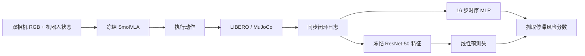

# VLA-SafeBench

**VLA-SafeBench** 是一个基于 SmolVLA、LIBERO 和 MuJoCo 的闭环 VLA 运行时评测项目。

项目研究两个问题：
1. 机器人执行过程中能否预测失败
2. 高预测分数究竟来自真实失效信号，还是仅仅来自"任务做到了哪一步"。


项目不微调 SmolVLA。SmolVLA 始终作为冻结的执行策略。在其外部训练了两个轻量级预测器（一个temporal MLP 一个linear probe），并通过独立数据和进度对照检验这些预测器实际读取了什么。

## 核心结果

阶段1的模型能够预测 LIBERO-Spatial task 4 的最终成功或失败，但真实物体阶段控制显示，高分主要来自预测器读取任务执行进度，而不是学会预测失效。

阶段2将问题重构为一个具有明确事件时刻的 **pickup stall（抓取停滞）预测**：机械臂首次进入目标黑碗10cm范围后，先观察20步，再预测未来20步内黑碗是否仍无法移动4cm。

在独立采集的180条确认轨迹上，冻结双相机视觉预测器在严格 mixed-state 子集（同一初始场景下同时含正负样本）中取得：

| Model | AUPRC | AUROC | Same-state ranking |
| --- | ---: | ---: | ---: |
| 仅使用进度变量的对照模型 Stage-only baseline | 0.643 | 0.589 | 47/77 |
| 16 步状态-动作时序 MLP Temporal MLP | 0.815 | 0.715 | 64/77 |
| 冻结双相机视觉特征 + 线性预测头 Frozen dual-camera vision | **0.899** | **0.892** | **69/77** |

视觉模型相对“仅使用进度变量”的对照模型的 AUROC 提升为 **+0.302，95% CI [0.147, 0.456]**。这说明视觉特征中包含了仅靠“首次接近时刻”和“当前物体位移”无法解释、但与未来抓取停滞相关的信息。
预声明的同状态配对覆盖率为 36/61 = 59%，低于 80% 门槛，因此项目不据此声称已经实现通用失败检测、跨任务泛化或闭环 safe stop。

## 项目结构



每条闭环轨迹从第一个控制步开始同步记录：
- 主相机与腕部相机 RGB；
- 末端、夹爪和关节本体状态；
- 模型动作与实际执行动作；
- 推理与控制时延；
- task、seed、initial state、代码 revision 与 checkpoint digest；
- 仅用于标签和审计的仿真器诊断信息。
预测器只能读取部署时可获得的 RGB、本体状态、动作和时序信息。物体真实位姿等仿真器内部真值只用于事件标签、进度对照和评测，不进入预测器输入或归一化统计。

## 数据与实验阶段

项目共采集 **350条不重复的 task-4 闭环轨迹**：

| 阶段 | 轨迹数 | 用途 |
| --- | ---: | --- |
| v0.1 | 50 | 建立闭环系统、训练最终结果预测器并冻结数据划分 |
| v0.2 | 20 | 在未见初始场景上复评冻结模型 |
| v0.3 / v0.4 | 100 | 审计“任务进度”混淆并完成抓取停滞 pilot |
| v0.5 | 180 | 对冻结的抓取停滞模型做一次性独立确认 |

v0.5 在 30 个不同初始场景上进行独立确认，每个场景使用 6 组随机种子重复运行，共得到 180 条轨迹。按照预先冻结的事件定义筛选后，最终保留 144 条有效样本，其中 61 条发生抓取停滞，83 条正常推进。
为了排除“某些初始场景本身更容易失败”的影响，项目单独分析了在同一个初始场景下既出现过抓取停滞、也出现过正常推进的样本，共涉及 13 个初始场景、73 条轨迹。统计置信区间时按初始场景分组进行 10,000 次 bootstrap，避免把同一场景下的多次重复运行误当成完全独立的数据。

## 训练成果

| 组件 | 是否更新参数 | 作用 |
| --- | --- | --- |
| SmolVLA | No | 执行 task 4 |
| ResNet-50 encoder | No | 提取双相机视觉特征 |
| Temporal MLP | Yes | 从最近16步状态、动作和时延预测目标事件 |
| Linear probe | Yes | 从冻结双相机特征预测目标事件 |

Temporal MLP 使用每步25维 proprioception、7维实际动作和2维 timing，网络为 `128 → 64 → 1`。视觉分支将两个相机各2048维的冻结 ResNet-50 特征拼接为4096维，只训练一个线性概率头。

两个 predictor 在同一实验阶段预测相同标签，区别只在输入：temporal 读取近期运动历史，vision 读取当前视觉构型。

## 如何排除“模型只是在读任务进度”

如果只看视觉模型的 AUROC，很难判断它到底学到了失效信号，还是只是发现“失败轨迹通常做得更慢”。因此 Phase 2 额外构造了一个只使用两个进度变量的对照模型：
1. 机械臂第一次进入目标 10 cm 范围的时刻；
2. 预测时目标物体相对首次接近位置的三维位移。
这两个变量来自仿真器内部真值，只用于评测，不提供给部署预测器。

如果视觉模型在控制这些进度因素后仍然稳定优于对照模型，说明视觉特征中包含了这些简单进度变量无法解释的信息。这个结果并不等于已经排除所有可能的进度表征，也不能直接说明模型具体依赖的是夹爪对准、遮挡还是接触状态；它只说明存在进度之外的额外预测信号。

## 运行与复现

```bash
python -m venv .venv && source .venv/bin/activate
pip install -r requirements.txt
export PYTHONPATH="$PWD/src"

python -m pytest -q
```

复现 v0.5 冻结确认评测：

```bash
bash scripts/reproduce_v05_confirmation.sh
```

该脚本封装了冻结模型、pilot 协议和 manifest 的完整参数；各参数含义与产物路径见 [`docs/release-artifacts.md`](docs/release-artifacts.md)。

大型 rollout、视频、模型权重与 feature cache 不提交 Git。仓库通过 manifest、结果 JSON 和 SHA-256 清单记录其身份与完整性。

## 仓库结构

```text
vlasafe/
├── src/vlasafe/    # 核心库：rollout 记录、输入边界、监控器与评测指标
├── scripts/        # 数据采集、特征提取、模型训练和冻结评测入口
├── tests/          # 数据协议、事件规则与评测代码的自动化测试
├── docs/
│   ├── manifests/  # 冻结的数据划分、采集网格与实验协议
│   └── figures/    # 结果图与绘图元数据
└── artifacts/      # 小型结果 JSON、metadata 与 SHA-256 清单
```

## 结论

当前实验结果支持：
- 同一 task 内，最终成功/失败的预测信号可以复现；
- Phase 1 的高 outcome 分数主要由任务执行进度解释；
- 对于已明确定义的抓取停滞事件，冻结视觉特征包含简单进度变量无法解释的短期预测信号。

当前证据不支持：
- 通用 VLA 失败检测；
- held-out task、物体或机器人平台泛化；
- 抓取开始前的失败预知；
- 可靠概率阈值或闭环 safe stop；
- 对视觉模型具体因果判据的机制定位。
