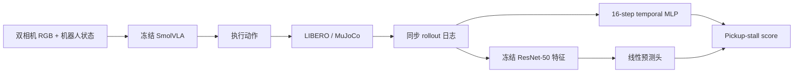

# VLA-SafeBench

**VLA-SafeBench** 是一个基于 SmolVLA、LIBERO 和 MuJoCo 的闭环 VLA 运行时评测项目。项目研究两个问题：机器人执行过程中能否预测失败，以及高预测分数究竟来自真实失效信号，还是仅仅来自“任务做到了哪一步”。

项目不微调 SmolVLA。SmolVLA 始终作为冻结的执行策略；我们在其外部训练轻量级预测器，并通过独立数据和进度对照检验这些预测器实际读取了什么。

## 核心结果

Phase 1 的模型能够预测 LIBERO-Spatial task 4 的最终成功或失败，但真实物体阶段控制显示，高分主要来自任务执行进度，不能解释为失效前兆。

Phase 2 将问题重构为一个具有明确事件时刻的 **pickup stall（抓取停滞）预测**：机械臂首次进入目标黑碗 10 cm 范围后，先观察20步，再预测未来20步内黑碗是否仍无法移动4 cm。

在独立采集的180条确认轨迹上，冻结双相机视觉预测器在严格 mixed-state 子集中取得：

| Model | AUPRC | AUROC | Same-state ranking |
| --- | ---: | ---: | ---: |
| Stage-only baseline | 0.643 | 0.589 | 47/77 |
| Temporal MLP | 0.815 | 0.715 | 64/77 |
| Frozen dual-camera vision | **0.899** | **0.892** | **69/77** |

视觉模型相对 stage-only baseline 的 AUROC 提升为 **+0.302，95% CI [0.147, 0.456]**。这说明冻结视觉表示包含由“首次接近时刻”和“当前物体位移”无法解释、但与未来 pickup stall 相关的信号。

预声明的同状态配对覆盖率为 `36/61 = 59%`，低于80%门槛，因此整体 formal support gate 未通过。项目不据此声称通用失败检测、跨任务泛化或 safe stop。

## 系统



每个 rollout 从第一个控制步开始同步记录：

- 主相机与腕部相机 RGB；
- 末端、夹爪和关节本体状态；
- 模型动作与实际执行动作；
- 推理与控制时延；
- task、seed、initial state、代码 revision 与 checkpoint digest；
- 仅用于标签和审计的仿真器诊断信息。

Predictor 只能读取部署时可获得的 RGB、proprioception、动作与 timing。物体真实位姿等 privileged state 只用于事件标签、进度基线和评测，不进入 predictor 或归一化统计。

## 数据与实验阶段

项目共采集 **350条不重复的 task-4 闭环轨迹**：

| Version | Episodes | Purpose |
| --- | ---: | --- |
| v0.1 | 50 | 闭环系统、Outcome predictor 与冻结 split |
| v0.2 | 20 | 冻结模型的独立 initial-state 确认 |
| v0.3 / v0.4 | 100 | 真实阶段控制与 pickup-stall pilot |
| v0.5 | 180 | 冻结 pickup-stall 模型的一次性独立确认 |

v0.5 采用 `30 initial states × 6 seeds` 的预声明网格。180条轨迹全部通过验证；严格事件规则保留144条样本，其中61条 pickup stall、83条正常推进。严格 mixed-state 子集包含73条轨迹、36条正类和13个同时具有正负样本的 initial states。

置信区间以 `initial_state_id` 为 cluster 进行10,000次 bootstrap，避免把相同起始场景下的重复执行视为完全独立样本。

## 训练了什么

| Component | Updated? | Role |
| --- | --- | --- |
| SmolVLA | No | 执行 task 4 |
| ResNet-50 encoder | No | 提取双相机视觉特征 |
| Temporal MLP | Yes | 从最近16步状态、动作和时延预测目标事件 |
| Linear probe | Yes | 从冻结双相机特征预测目标事件 |

Temporal MLP 使用每步25维 proprioception、7维实际动作和2维 timing，网络为 `128 → 64 → 1`。视觉分支将两个相机各2048维的冻结 ResNet-50 特征拼接为4096维，只训练一个线性概率头。

两个 predictor 在同一实验阶段预测相同标签，区别只在输入：temporal 读取近期运动历史，vision 读取当前视觉构型。

## 为什么需要 stage-only baseline

仅报告视觉 AUROC 无法排除模型通过任务进度答题。Phase 2 的 stage-only baseline 只读取两个 privileged 进度变量：

1. 机械臂第一次进入目标10 cm范围的时刻；
2. 预测时目标物体相对首次接近位置的三维位移。

只有部署模型稳定超过该基线，才能说明它包含这两个进度变量无法解释的信息。这个比较不代表排除了所有可能的进度表征，也没有定位视觉模型具体使用了夹爪对准、遮挡或接触状态中的哪一种信号。

## 运行与复现

环境准备：

```bash
source /root/autodl-tmp/envs/vlasafe312/bin/activate
export PYTHONPATH="$PWD/src"
```

运行测试：

```bash
python -m pytest -q
```

使用已经生成的 v0.5 输入复现冻结确认评测：

```bash
python scripts/evaluate_frozen_pickup_stall_confirmation.py \
  artifacts/v05/datasets/task4_pickup_stall_confirmation.npz \
  artifacts/v05/features/task4_pickup_stall_confirmation_frozen_vision.npz \
  --pilot-temporal artifacts/v04/datasets/task4_pickup_stall_pilot_strict.npz \
  --pilot-report artifacts/results/v04_task4_pickup_stall_pilot_strict.json \
  --model artifacts/results/v04_task4_pickup_stall_pilot_strict.pt \
  --confirmation-manifest docs/manifests/v05_task4_pickup_stall_confirmation.json \
  --output artifacts/results/v05_task4_pickup_stall_frozen_confirmation.json \
  --bootstrap-samples 10000 --device cuda
```

大型 rollout、视频、模型权重与 feature cache 不提交 Git。仓库通过 manifest、结果 JSON 和 SHA-256 清单记录其身份与完整性。完整产物索引见 [`docs/release-artifacts.md`](docs/release-artifacts.md)。

## 结论边界

当前证据支持：

- 同一 task 内的 outcome association 可以复现；
- Phase 1 的 outcome 高分主要由任务进度解释；
- 针对冻结定义的 pickup-stall 事件，视觉 predictor 包含 stage-only 无法解释的短期预测信号。

当前证据不支持：

- 通用 VLA 失败检测；
- held-out task、物体或机器人平台泛化；
- 抓取开始前的失败预知；
- 可靠概率阈值或闭环 safe stop；
- 对视觉模型具体因果判据的机制定位。

完整实验历史、消融、部署故障审计和数值结果保留在 [`README.md`](README.md) 与 [`PROGRESS.md`](PROGRESS.md)。
